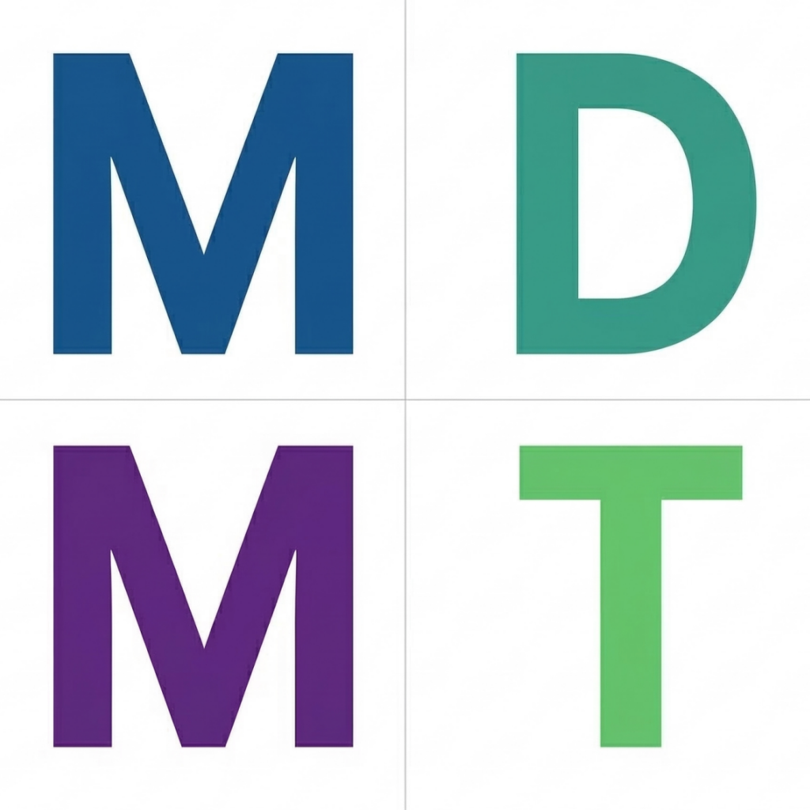

<p align="center"></p>

# Modular Digital Methodologies Toolkit (MDMT)

A comprehensive suite of digital humanities and research tools designed to streamline text analysis, document processing, and data extraction workflows.

## Overview

MDMT is a desktop application that provides researchers, scholars, and digital humanists with a variety of specialized tools for working with text-based documents. It offers a modular approach, allowing users to perform tasks ranging from optical character recognition to language translation and advanced text analysis, all through a unified web-based interface running in a native window.

## Features

### Document Processing
- **OCR (Optical Character Recognition)**: Convert image-based PDFs to searchable, selectable text using Tesseract OCR with support for 100+ languages
- **Audio Transcription**: Convert speech in audio files to text using OpenAI's Whisper model
- **Language Translation**: Translate documents between multiple languages using Google Translate

### Text Analysis
- **Keyword Search**: Find and analyze keyword patterns across document collections with visualization
- **Named Entity Recognition**: Identify and extract people, organizations, locations, and other named entities
- **Relationship Extraction**: Discover connections between entities in texts and visualize network graphs
- **Co-Word Analysis**: Generate word co-occurrence networks to reveal conceptual relationships

### AI Integration
- **RAGBot**: Chat with your documents using an AI assistant powered by local Qwen 3.5 models. MDMT auto-detects your hardware (NVIDIA, AMD, and Apple Metal GPUs) and recommends the best model size for your system.

## Installation

### Prerequisites
- Python 3.12 or newer
- Tesseract OCR (system package)
- Required Python dependencies (see `requirements.txt`)

### Setup
1. Clone this repository
2. Create a virtual environment and install dependencies:
   ```
   python -m venv .venv
   source .venv/bin/activate
   pip install -r requirements.txt
   ```
3. Run the application:
   ```
   python app.py
   ```

## Usage

Launch MDMT with `python app.py`. The application opens in a native desktop window with a sidebar for navigation between modules:

1. **OCR**: Process PDFs to make them searchable with text selection
2. **Audio Transcription**: Convert audio files to text transcriptions
3. **Translation**: Translate documents between languages
4. **Keyword Search**: Find and analyze keywords with context
5. **Named Entities**: Extract named entities from documents
6. **Relationships**: Identify entity relationships and generate network graphs
7. **Co-Words**: Generate word co-occurrence networks
8. **RAGBot**: Query your document collection using a local LLM
9. **Downloads**: Manage optional assets (Tesseract languages, Whisper models, NLTK data, LLM models)

Optional assets (language models, NLTK data, Tesseract language files) are downloaded on demand via the Downloads page. Large ML models are not bundled with the application.

A dark mode toggle is available in the sidebar.

## TODO

- Find an Apple Silicon Mac I can use for testing the MacOS binary
- Create a VM for testing windows binaries
   
## Dependencies

Major dependencies include:
- `nicegui` + `pywebview`: Web-based UI in a native desktop window
- `ocrmypdf`: OCR functionality
- `openai-whisper`: Audio transcription
- `googletrans`: Language translation
- `transformers`: Named entity recognition
- `nltk` + `networkx`: NLP and graph analysis
- `langchain` + `llama-cpp-python`: RAG implementation with local LLM inference
- `sentence-transformers` + `faiss-cpu`: Document embeddings and vector search
- `pandas`: Data manipulation
- `matplotlib`: Data visualization
- `pypdf`: PDF text extraction

See `requirements.txt` for a complete list, and the Help/About page for license details on each dependency.

## Building

Platform-specific PyInstaller spec files are provided, each bundling Tesseract OCR and its dependencies:

```
pip install pyinstaller
pyinstaller mdmt-linux.spec    # Linux
pyinstaller mdmt-macos.spec    # macOS
pyinstaller mdmt-windows.spec  # Windows
```

All specs use `--onedir` mode to avoid multi-GB extraction on each launch.

Automated cross-platform builds and releases are handled by GitHub Actions. A release is created automatically when a version tag is pushed.

## License

This project uses several open-source libraries, each with their own licenses. See the Help/About page within the application for a full attribution table with license types and project links.

## Contact

Software by James C. Caldwell
Email: James.Caldwell.000@gmail.com
GitHub: [James-C-000/Modular-Digital-Methodologies-Toolkit](https://github.com/James-C-000/Modular-Digital-Methodologies-Toolkit)
